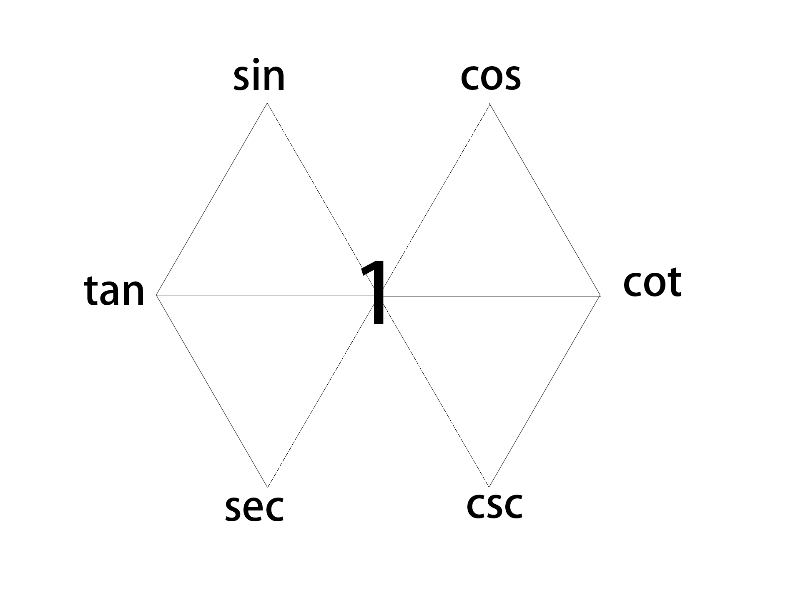

# 三角学
- [三角学](#三角学)
  - [和差化积公式](#和差化积公式)
  - [恒等六边形](#恒等六边形)

## 和差化积公式

$\sin\alpha+\cos\beta=2\sin\frac{\alpha+\beta}{2}\cos\frac{\alpha-\beta}{2}$

笑 + 笑 = 笑痛了哭
***
$\sin\alpha-\cos\beta=2\cos\frac{\alpha+\beta}{2}\sin\frac{\alpha-\beta}{2}$

笑 - 笑 = 哭了再笑
***
$\cos\alpha+\cos\beta=2\cos\frac{\alpha+\beta}{2}\cos\frac{\alpha-\beta}{2}$

哭 + 哭 = 一直哭到底
***
$\cos\alpha-\cos\beta=-2\sin\frac{\alpha+\beta}{2}\sin\frac{\alpha-\beta}{2}$

哭 - 哭 = 假笑，假笑要添负号
***

## 恒等六边形

包含以下规律：

对角的两个函数互为倒数关系；

中心数字为“1”.

通过上述规律，可得出以下恒等式：

1、积型恒等式：任意两函数的乘积等于两函数所夹的函数

$\sin x=\cos x*\tan x$

$\cos x=\sin x*\cot x$

$\tan x=\sin x*\sec x$

